<p align="center">
  
</p>

<p align="center">
  <strong>A native desktop app for orchestrating multiple Claude Code agents in parallel.</strong><br />
  <em>many voices, one stage</em>
</p>

<p align="center">
  <a href="#features">Features</a> &bull;
  <a href="#installation">Installation</a> &bull;
  <a href="#usage">Usage</a> &bull;
  <a href="#known-limitations">Known Limitations</a> &bull;
  <a href="#development">Development</a>
</p>

<p align="center">
  <a href="https://github.com/Jasonmart1002/Chorus/releases"></a>
  <a href="https://github.com/Jasonmart1002/Chorus/blob/main/LICENSE"></a>
  <a href="https://github.com/Jasonmart1002/Chorus/stargazers"></a>
  
</p>

---

## The Problem

Running several coding agents at once usually means juggling a pile of terminals, losing track of which one finished, which one needs approval, and which one just errored out.

## The Solution

Chorus puts your local Claude Code agents in one desktop app. Create agents per repo, stream output live, queue attention-heavy work in Vibe Mode, run shell commands, inspect diffs, and schedule recurring automations without terminal sprawl.

---

<p align="center">
  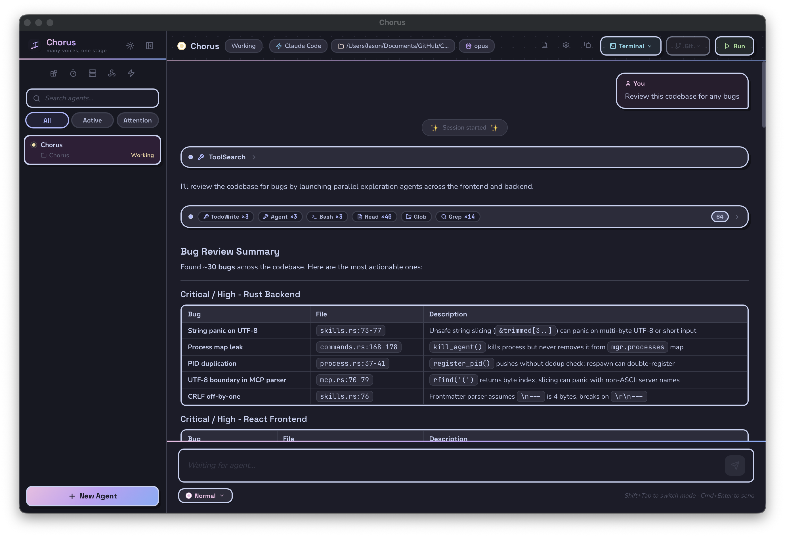
</p>

<p align="center">
  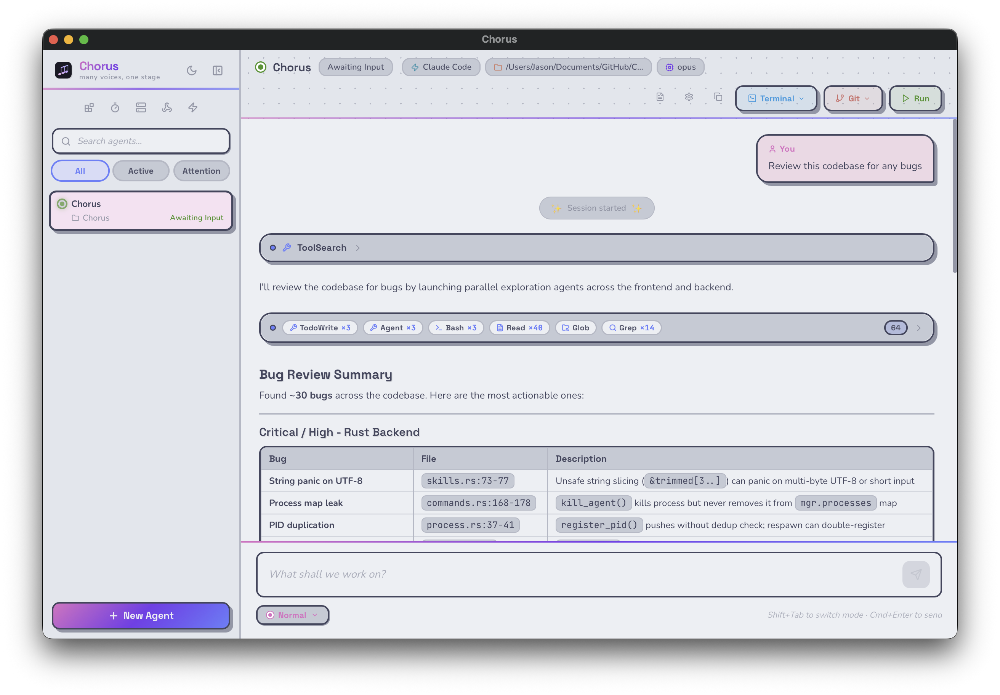
</p>

<details>
<summary><strong>More screenshots</strong></summary>

### Vibe Mode

Run multiple agents at once and work through the attention queue without hunting through tabs.

|                        Light                        |                       Dark                        |
| :-------------------------------------------------: | :-----------------------------------------------: |
| 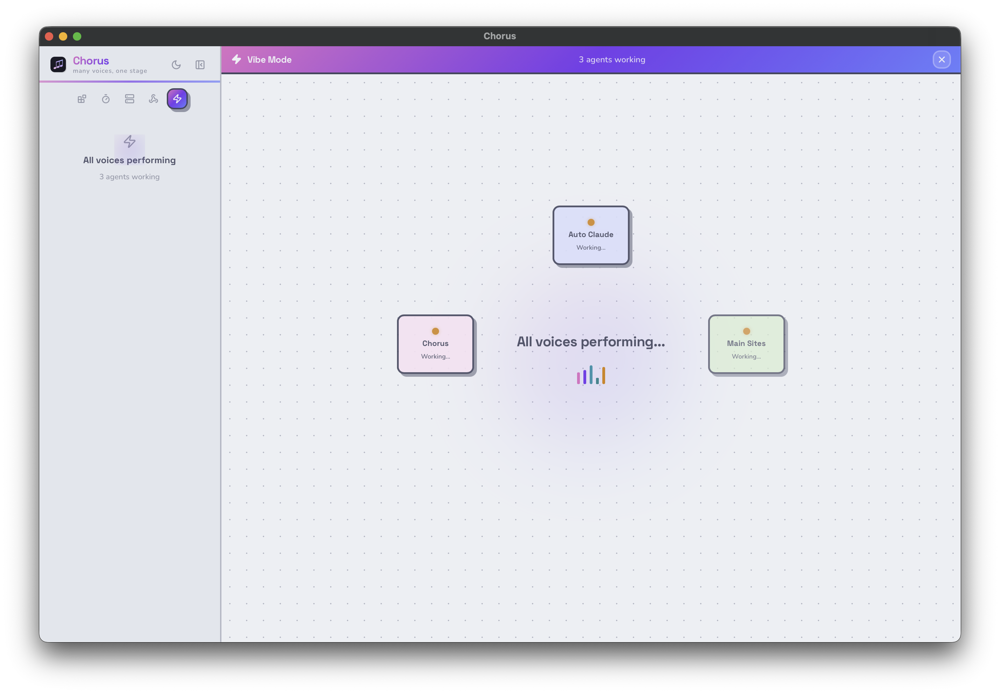 | 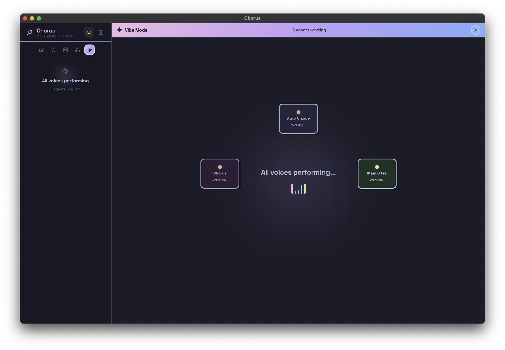 |

### New Agent Dialog

Create agents from scratch or start from a template, then pick a working directory, model, and permission mode.

<p align="center">
  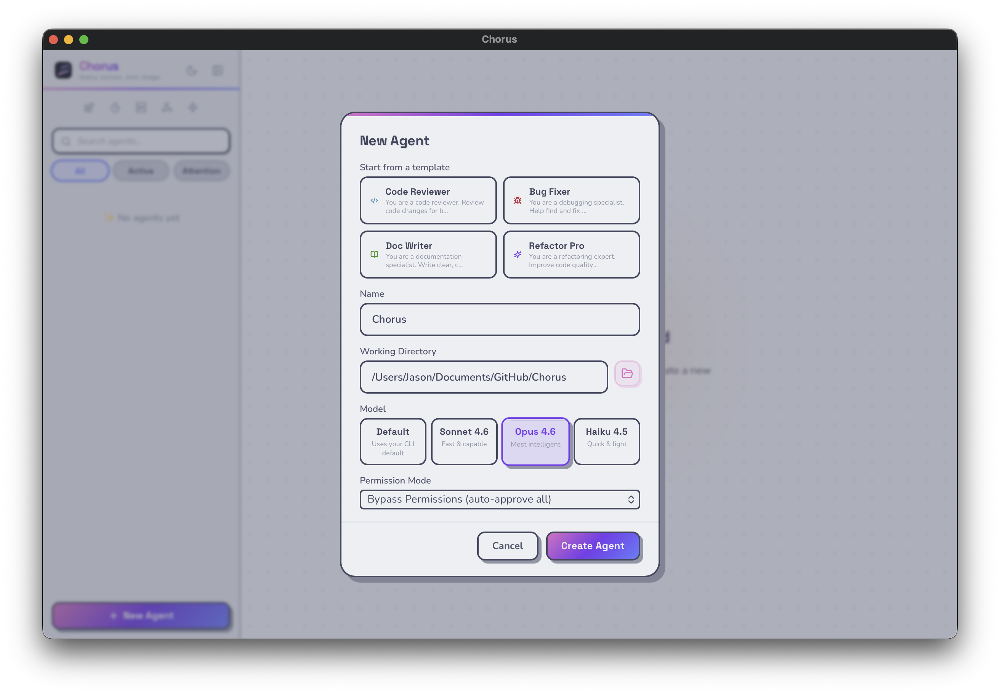
</p>

### Automations

Schedule prompts to run on a recurring basis: daily, weekly, monthly, or custom intervals.

|                          Light                          |                         Dark                          |
| :-----------------------------------------------------: | :---------------------------------------------------: |
| 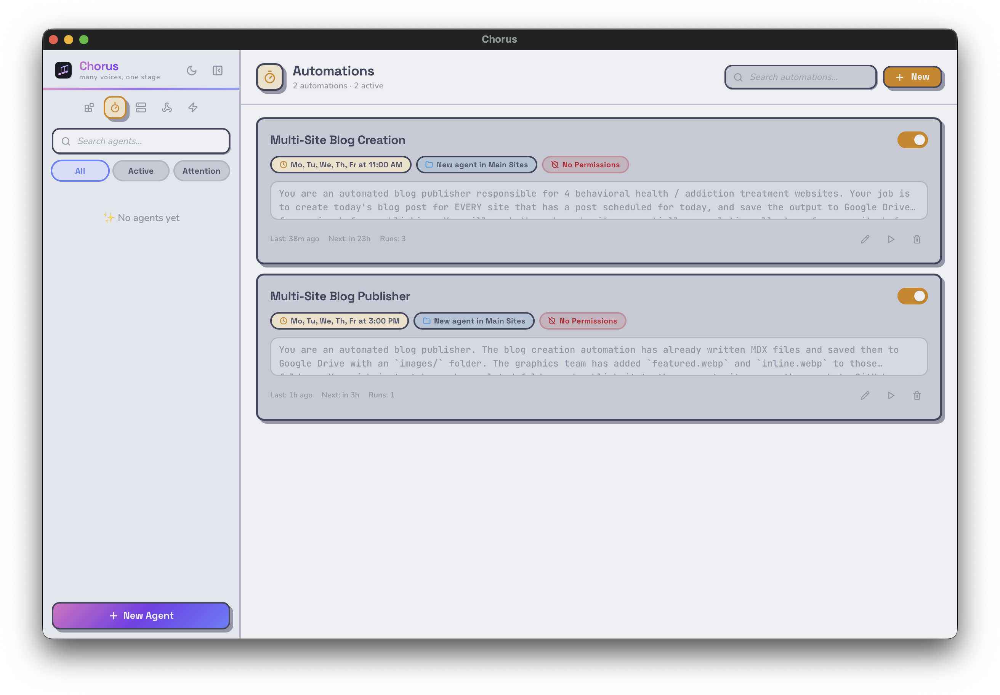 | 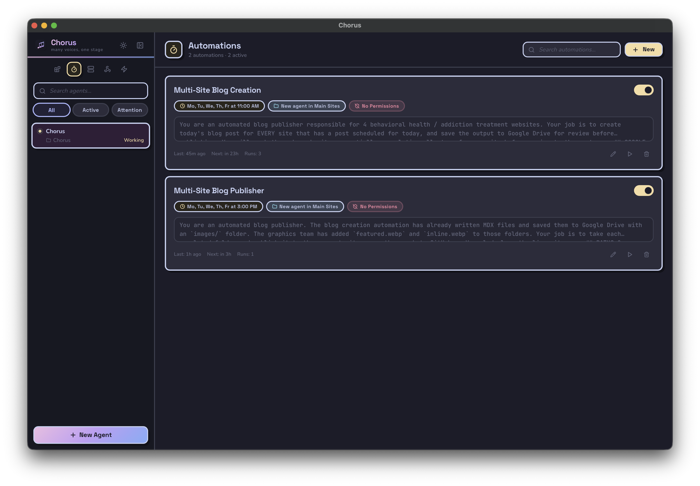 |

### MCP Servers

Manage Claude Code MCP servers from the UI, including project-scoped servers tied to a selected workspace.

|                          Light                          |                         Dark                          |
| :-----------------------------------------------------: | :---------------------------------------------------: |
| 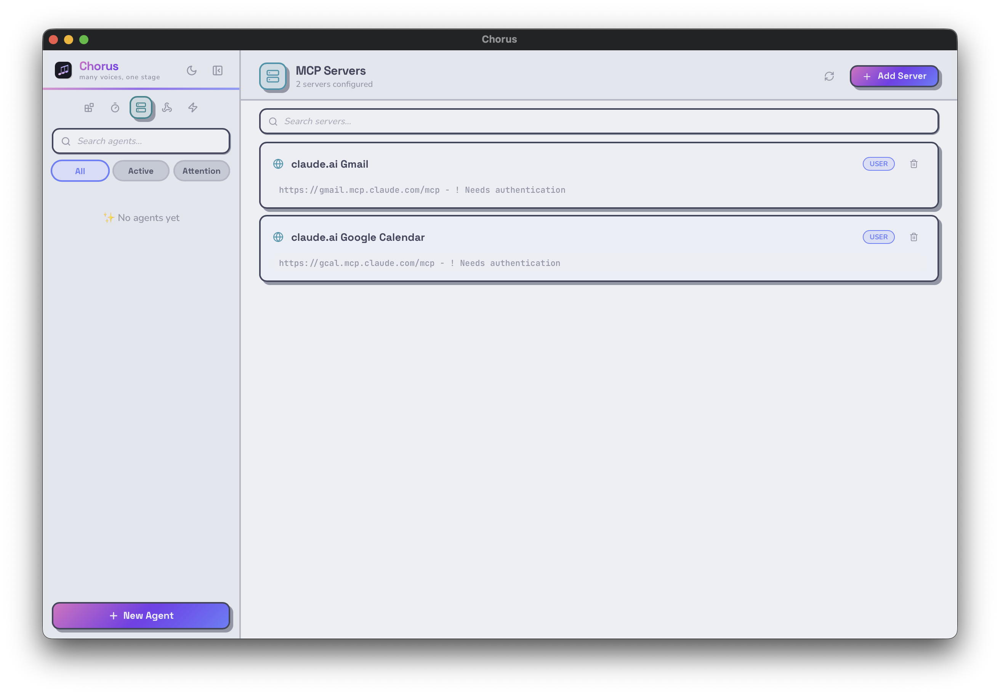 | 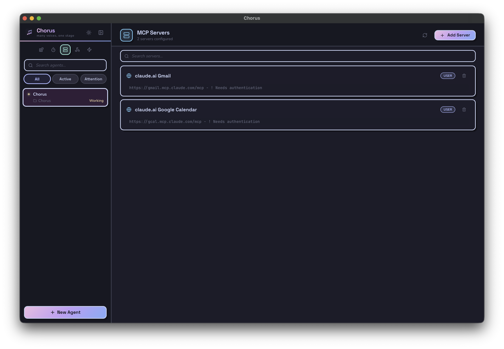 |

### Skills & Plugins

Browse installed Claude Code plugins, skills, and slash commands.

|                     Light                     |                    Dark                     |
| :-------------------------------------------: | :-----------------------------------------: |
| 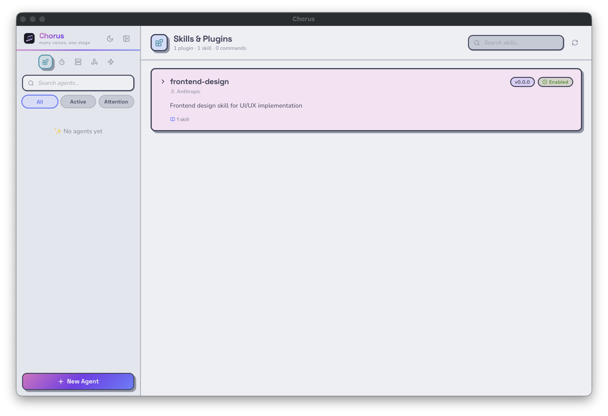 | 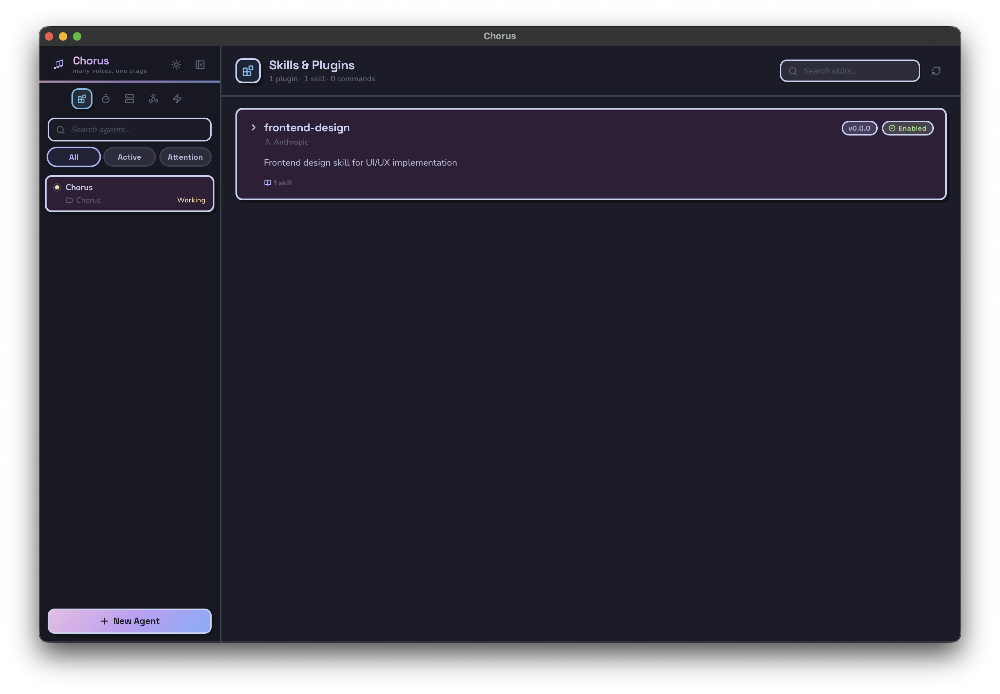 |

### Hooks & Skills Editor

Edit Claude Code hooks and custom skills without leaving the app.

|                    Light                    |                   Dark                    |
| :-----------------------------------------: | :---------------------------------------: |
| 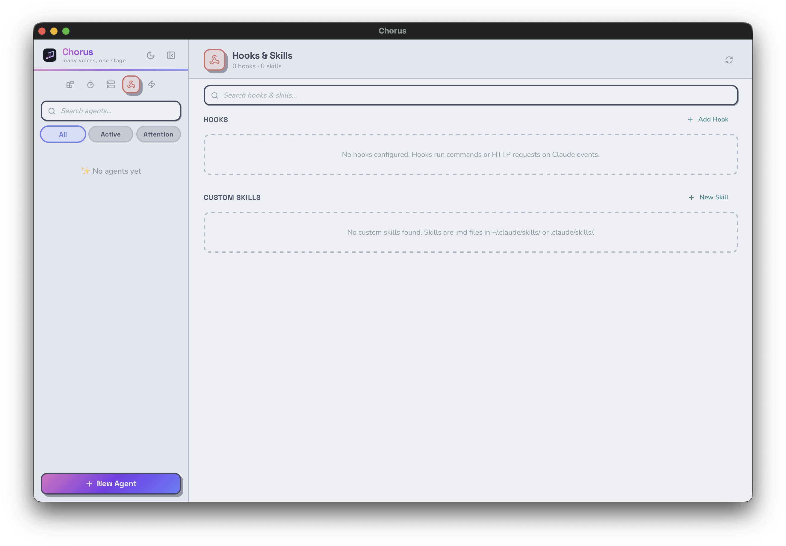 | 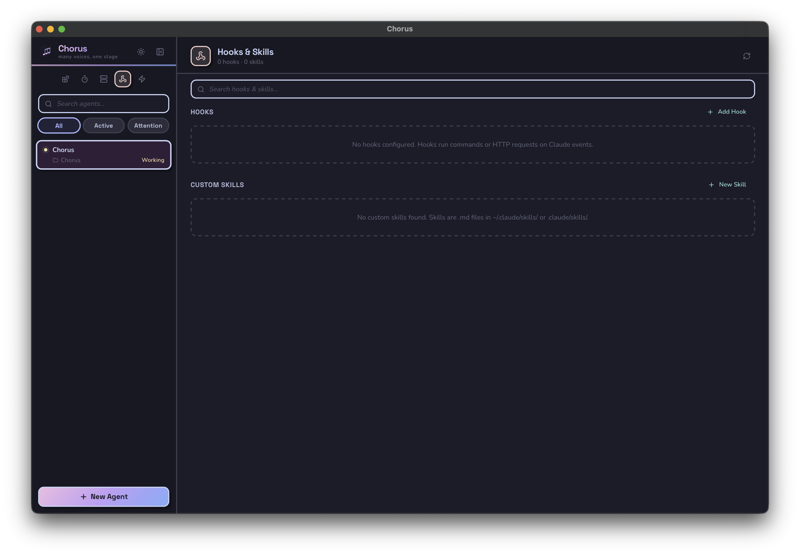 |

</details>

---

## Features

### One Window, Many Repos

Create as many agents as you need across different projects. Pin them, archive them, rename them, drag to reorder, filter by status, and search by name or path.

### Real-Time Streaming

See agent output as it happens: assistant text, tool calls, tool results, plans, diffs, system events, and final results.

### Vibe Mode

Treat agent work like an inbox. Chorus queues agents that need attention and lets you move through them one by one with keyboard shortcuts.

### Git Quick Actions

Inspect diffs, run common git workflows, and hand off repo tasks to an agent without leaving the app.

### Run Shell Commands

Execute commands in an agent's working directory with live stdout/stderr streaming. Command output is isolated per agent, even when multiple agents point at the same repo.

### Automations

Schedule prompts daily, weekly, monthly, or on a custom interval. Automations can target an existing agent or create a fresh one and are tracked while running.

### Conversation Export

Copy an agent conversation as Markdown for handoff, notes, or archival.

### Notifications

Get in-app toasts and OS-native notifications when agents finish, error, or need input.

### Theme + Keyboard Workflow

The app is built to be fast from the keyboard, with persistent theme choice, queue navigation, and quick actions for git, terminal, run, and config flows.

### Claude Ecosystem Tools

For Claude-based workflows, Chorus also includes a `CLAUDE.md` editor, MCP server management, hooks editing, skills editing, and Claude CLI terminal handoff.

## Installation

### Supported Platforms

- macOS: Apple Silicon and Intel
- Windows: x64
- Linux: x64

macOS is currently the best-tested environment. Windows and Linux release assets are built in CI and published on GitHub Releases.

### Prerequisites

Install and authenticate Claude Code:

```bash
npm install -g @anthropic-ai/claude-code
```

For source builds you will also need:

- Node.js 20 recommended
- Rust stable toolchain

### Download a Release

Download the latest release from the [Releases page](https://github.com/Jasonmart1002/Chorus/releases/latest) and choose the asset that matches your OS:

- macOS Apple Silicon: `aarch64` `.dmg`
- macOS Intel: `x64` `.dmg`
- Windows: `.msi` or `.exe`
- Linux: `.deb` or `.AppImage`

Open-source release builds are currently unsigned. On first launch, macOS Gatekeeper or Windows SmartScreen may warn before letting you open the app.

### Build From Source

```bash
git clone https://github.com/Jasonmart1002/Chorus.git
cd Chorus
npm ci
npm run tauri dev
```

To produce release bundles locally:

```bash
npm run tauri build
```

Build output lands in `src-tauri/target/release/bundle/`.

---

## Usage

### Create an Agent

1. Click **+ New Agent** or press `Cmd+N` (`Ctrl+N`)
2. Pick a working directory
3. Optionally set a model, permission mode, and template
4. Start prompting

### Work in Parallel

Switch agents with `Cmd+1` through `Cmd+9`, `Cmd+J`, or `Shift+Cmd+J`. Every agent keeps its own transcript and status, so you can review or steer them independently.

### Plan Mode

Use `Shift+Tab` in the prompt box to switch between normal prompting and plan-first prompting. Chorus prepends plan instructions before sending the prompt.

### Stop and Restart

Claude agents restart with the same session and can resume conversation state.

### Claude-Specific Tools

When using Claude agents, Chorus can also:

- Open `claude --resume` in your terminal
- Edit project and user `CLAUDE.md`
- Manage MCP servers
- Edit hooks and custom skills
- Browse installed Claude plugins and slash commands

---

## Keyboard Shortcuts

> On Windows and Linux, replace **Cmd** with **Ctrl**.

| Shortcut                | Action                          |
| ----------------------- | ------------------------------- |
| `Cmd+N`                 | New agent                       |
| `Cmd+1` - `Cmd+9`       | Switch to agent 1-9             |
| `Cmd+J` / `Shift+Cmd+J` | Next / previous agent           |
| `Cmd+Enter`             | Send prompt                     |
| `Shift+Tab`             | Toggle prompt mode              |
| `Cmd+F`                 | Focus sidebar search            |
| `Cmd+L`                 | Focus prompt input              |
| `Shift+Cmd+V`           | Toggle Vibe Mode                |
| `Shift+Cmd+S`           | Skip current agent in Vibe Mode |
| `Shift+Cmd+G`           | Open Git actions                |
| `Shift+Cmd+R`           | Open Run dialog                 |
| `Shift+Cmd+E`           | Open Terminal actions           |
| `Shift+Cmd+P`           | Toggle Skills view              |
| `Shift+Cmd+A`           | Toggle Automations view         |
| `Shift+Cmd+M`           | Toggle MCP view                 |
| `Shift+Cmd+H`           | Toggle Hooks view               |
| `Cmd+.`                 | Open agent config               |
| `Shift+Cmd+T`           | Toggle theme                    |
| `Cmd+K`                 | Show shortcut help              |

---

## Known Limitations

- Chorus manages the local Claude Code CLI; it does not install, update, or authenticate it for you.
- Open-source release builds are currently unsigned, so first-launch OS warnings are expected on macOS and Windows.
- Windows and Linux builds are published, but the heaviest local validation in this repo has been on macOS.

---

## Architecture

```text
┌────────────────────────────────────────────────────┐
│                 React + Zustand UI                 │
│      streaming transcripts, controls, dialogs      │
└───────────────────────┬────────────────────────────┘
                        │ Tauri IPC (invoke / listen)
┌───────────────────────┴────────────────────────────┐
│                 Rust Backend (Tauri)               │
│  agent lifecycle, adapters, automations, commands  │
└───────────────────────┬────────────────────────────┘
                        │
                   Claude Code
```

The Rust backend manages the Claude Code process registry, persists agent state, and emits real-time events that the React frontend renders.

---

## Tech Stack

| Layer      | Technology                          |
| ---------- | ----------------------------------- |
| Frontend   | React 19, TypeScript, Vite, Zustand |
| Desktop    | Tauri v2 (Rust)                     |
| Styling    | Custom theme system and CSS         |
| AI Backend | Claude Code CLI                     |
| Rendering  | React Markdown, syntax highlighting |

---

## Development

```bash
npm ci
npm run tauri dev
```

Useful verification commands:

```bash
npm run build
cd src-tauri && cargo fmt --check
cd src-tauri && cargo clippy --all-targets --all-features -- -D warnings
cd src-tauri && cargo test
```

### Project Structure

```text
src/                    # React frontend
  components/           # UI components, dialogs, views
  store/                # Zustand state stores
  types/                # TypeScript type definitions
  lib/                  # Theme, constants, platform helpers
  hooks/                # Custom React hooks
src-tauri/              # Rust backend
  src/agent/            # Process spawning, state management, engine adapters
  src/automations.rs    # Automation scheduler and execution
  src/skills.rs         # Claude plugin and skill discovery
  src/mcp.rs            # MCP server management
  src/commands.rs       # Tauri IPC command handlers
```

Release steps for maintainers live in [RELEASING.md](RELEASING.md).

---

## Contributing

Contributions are welcome.

- Bug reports: [open an issue](https://github.com/Jasonmart1002/Chorus/issues/new?template=bug_report.md)
- Feature requests: [open an issue](https://github.com/Jasonmart1002/Chorus/issues/new?template=feature_request.md)
- Pull requests: fork the repo, create a branch, and open a PR

If your change touches Claude Code behavior, mention what you tested locally.

---

## License

[MIT](LICENSE) - Jason Martinez

---

<p align="center">
  <sub>Built with Tauri, React, and too many agents running at once.</sub>
</p>
