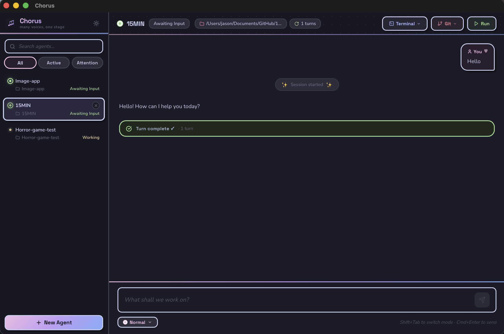
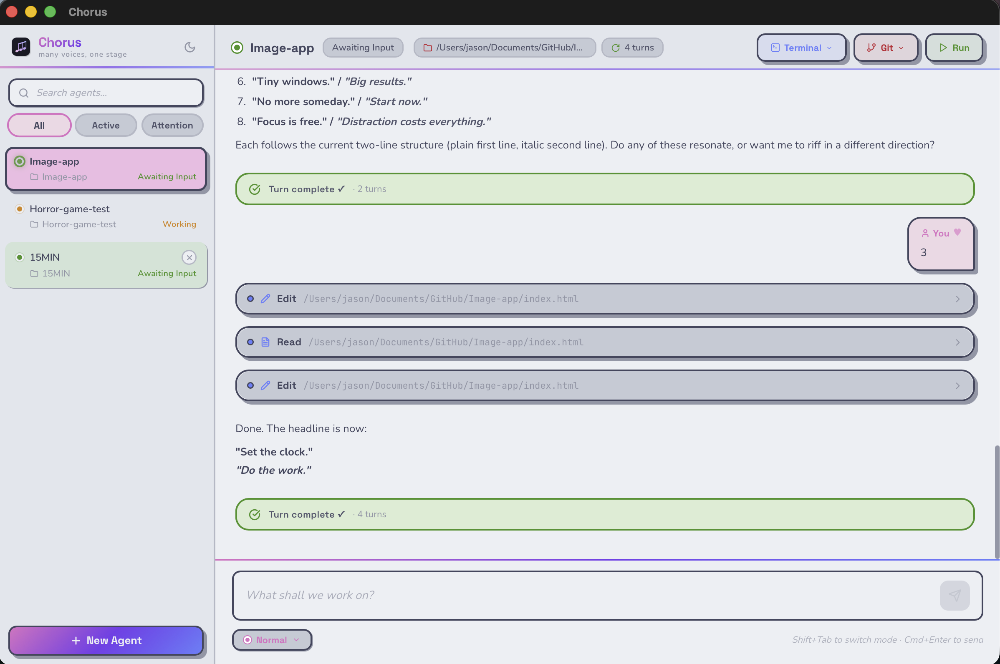
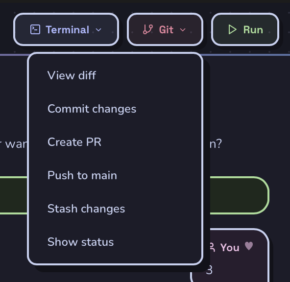
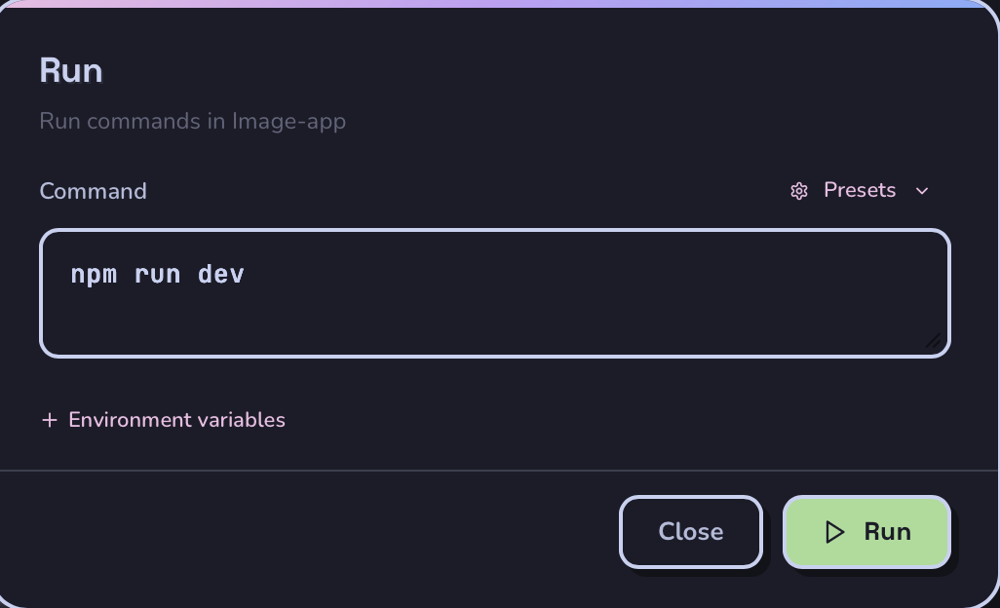
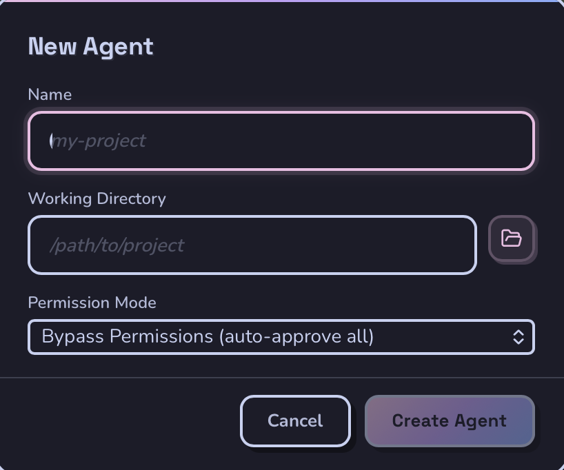
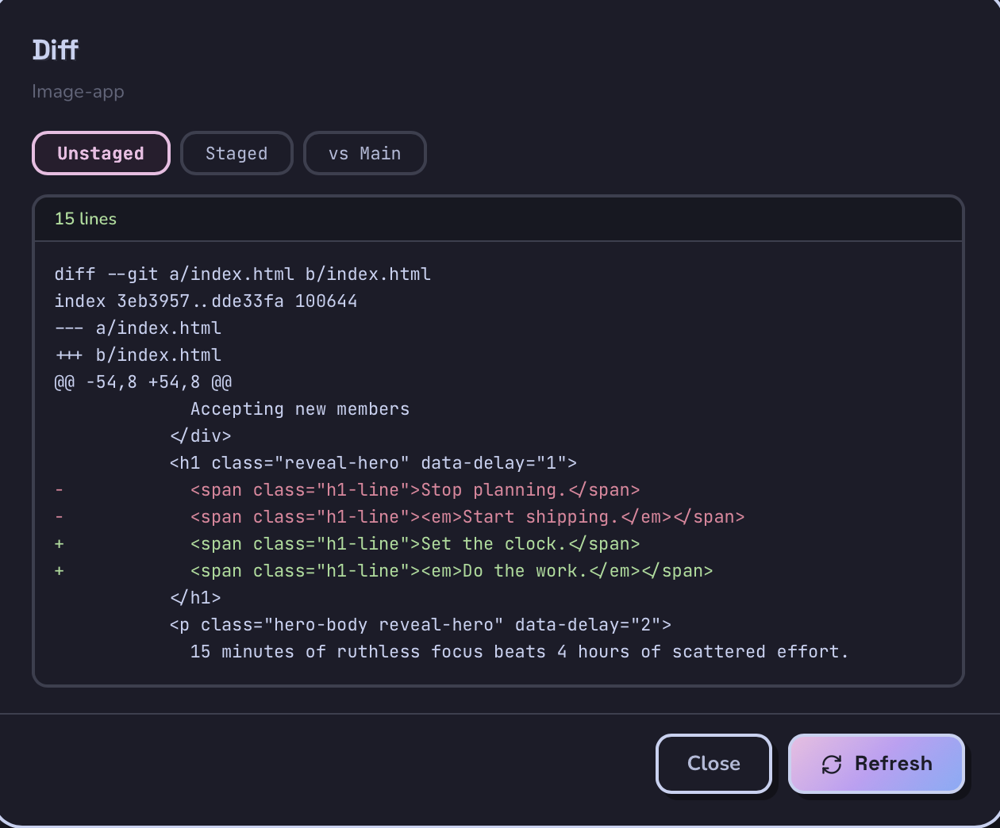
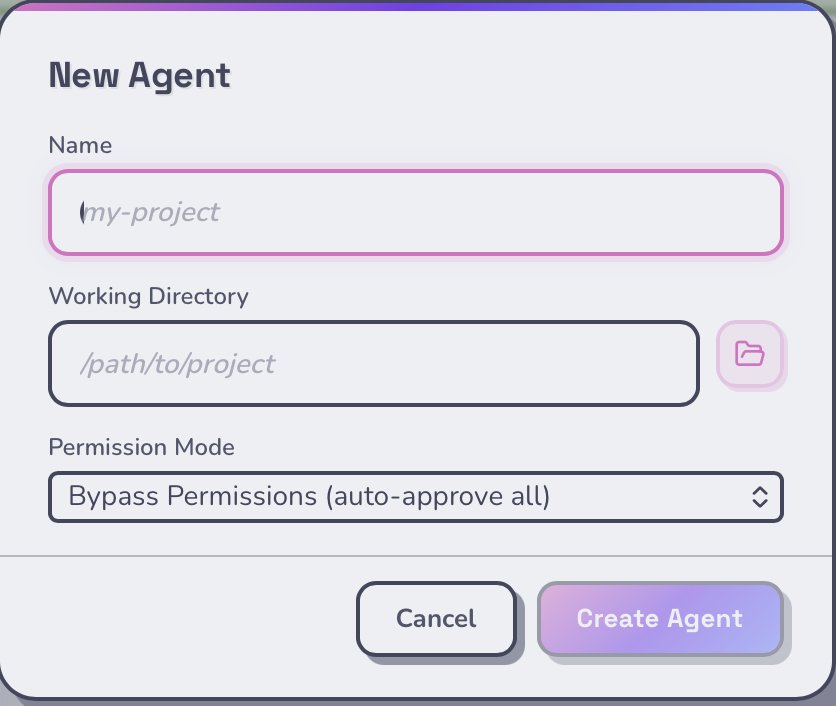

<p align="center">
  
</p>

<p align="center">
  <strong>A native desktop app for running multiple AI coding agents in parallel.</strong><br />
  <em>many voices, one stage</em>
</p>

<p align="center">
  <a href="#features">Features</a> &bull;
  <a href="#installation">Installation</a> &bull;
  <a href="#usage">Usage</a> &bull;
  <a href="#keyboard-shortcuts">Shortcuts</a> &bull;
  <a href="#architecture">Architecture</a> &bull;
  <a href="#development">Development</a>
</p>

<p align="center">
  <a href="https://github.com/Jasonmart1002/Chorus/releases"></a>
  <a href="https://github.com/Jasonmart1002/Chorus/blob/main/LICENSE"></a>
  <a href="https://github.com/Jasonmart1002/Chorus/stargazers"></a>
  
</p>

---

## The Problem

You're using AI coding agents across multiple projects. Each one needs its own terminal. You're alt-tabbing between 5+ windows, losing track of which agent finished, which one errored, and which one is waiting for input.

## The Solution

Chorus puts every agent in **one window**. Supports **Claude Code**, **OpenAI Codex**, and **Google Gemini CLI** — pick your engine per agent. Create agents, assign them to project directories, fire off prompts, and let them work in parallel. When an agent finishes or needs your attention, you'll know immediately — no terminal archaeology required.

---

<p align="center">
  
</p>

<p align="center">
  
</p>

<details>
<summary><strong>More screenshots</strong></summary>

| Git Quick Actions | Run Commands | New Agent |
|:-:|:-:|:-:|
|  |  |  |

| Diff Viewer | Light Theme |
|:-:|:-:|
|  |  |

</details>

---

## Features

### Cross-Platform
Runs natively on **macOS**, **Windows**, and **Linux**. Platform-specific process management, terminal integration, and keyboard shortcuts are handled automatically — same experience everywhere.

### Multi-Engine Support
Run **Claude Code**, **OpenAI Codex**, or **Google Gemini CLI** agents side by side. Chorus auto-detects which engines are installed and normalizes their output into a unified interface. Pick the best engine for each task.

### Multi-Agent Management
Create as many agents as you need. Each gets its own process, scoped to a specific project directory, with an independent conversation and session history. Choose models and permission modes per agent.

### Real-Time Streaming
Every agent streams its output live — text responses, tool calls, results — rendered with full **Markdown** and **syntax highlighting**. No polling, no refresh.

### Vibe Mode
A focused workflow for handling multiple agents that need attention. Toggle it with `Shift+Cmd+V` (`Shift+Ctrl+V` on Windows/Linux) and Chorus auto-navigates through agents waiting for input, one at a time. See what each agent last worked on, respond, and move to the next — like a review queue for your agents.

### Git Quick Actions
Built-in shortcuts for the most common Git workflows: **view diffs** (unstaged, staged, or vs. main), **commit**, **create PRs**, **push**, and **stash** — all without leaving the app.

### Run Shell Commands
Execute arbitrary commands in any agent's working directory with live stdout/stderr streaming. Includes presets for npm, yarn, pnpm, and bun. Your last command is remembered per directory.

### Terminal Handoff
Need to go deeper? Open a native terminal at any agent's directory, or launch an interactive `claude --resume` session that picks up exactly where the agent left off.

### Agent Organization
**Pin** important agents to the top. **Archive** ones you're done with. **Rename** them. **Drag-and-drop** to reorder. **Filter** by status — active, needs attention, or show all. **Search** by name or path.

### Notifications
In-app toasts and **OS-native notifications** when any agent completes or errors. Never miss a result.

### Light & Dark Themes
Beautiful **Catppuccin**-inspired palettes (Latte & Mocha) with warm pastels, soft gradients, and a playful chunky design. Toggle with `Shift+Cmd+T` (`Shift+Ctrl+T` on Windows/Linux). Persists across sessions.

### Automations
Schedule prompts to run automatically — **daily**, **weekly**, **monthly**, or at a **custom interval**. Pick specific days of the week, target an existing agent or spin up a new one. Monitor running automations and view run history.

### Skills Browser
Browse and search installed Claude Code plugins, skills, and slash commands. See metadata, arguments, and file paths at a glance.

### Keyboard-First
Every important action has a shortcut. See the full list in the [Keyboard Shortcuts](#keyboard-shortcuts) section below, or press `Cmd+K` (`Ctrl+K` on Windows/Linux) in the app.

---

## Installation

### Prerequisites

- At least one supported CLI installed: [Claude Code](https://docs.anthropic.com/en/docs/claude-code), [OpenAI Codex](https://github.com/openai/codex), or [Google Gemini CLI](https://github.com/google-gemini/gemini-cli)
- [Node.js](https://nodejs.org/) 18+
- [Rust](https://rustup.rs/) toolchain

### From Source

```bash
git clone https://github.com/Jasonmart1002/Chorus.git
cd Chorus
npm install
npx tauri build
```

The built app will be in `src-tauri/target/release/bundle/`.

### Download

Grab the latest build from the [Releases page](https://github.com/Jasonmart1002/Chorus/releases/latest).

---

## Usage

### Create an Agent

1. Click **+ New Agent** or press `Cmd+N` (`Ctrl+N`)
2. Enter a name and select a working directory
3. Optionally choose a model and permission mode
4. The agent spawns immediately and is ready for prompts

### Work in Parallel

Send a prompt to one agent, switch to another with `Cmd+2` (`Ctrl+2`), send a different prompt. Both run simultaneously. The sidebar shows live status for every agent — green for working, yellow for waiting, red for errors.

### Plan Mode

Toggle with `Shift+Tab` before sending. The agent will draft an implementation plan for your approval before writing any code.

### Vibe Mode

Press `Shift+Cmd+V` (`Shift+Ctrl+V`) to enter Vibe Mode. Chorus queues up every agent that's waiting for input and presents them one at a time. Respond, skip, or let the queue guide your workflow. Great for managing 5+ agents at once.

### Stop & Resume

Hit **Stop** to interrupt an agent mid-task. Chorus transparently restarts the process with the same session — the conversation history is preserved and the agent picks up right where it was.

---

## Keyboard Shortcuts

> On Windows/Linux, replace **Cmd** with **Ctrl**.

| Shortcut | Action |
|----------|--------|
| `Cmd+N` | New agent |
| `Cmd+1` – `Cmd+9` | Switch to agent 1–9 |
| `Cmd+Enter` | Send prompt |
| `Shift+Tab` | Toggle plan mode |
| `Shift+Cmd+V` | Toggle Vibe Mode |
| `Shift+Cmd+T` | Toggle light/dark theme |
| `Shift+Cmd+J` | Previous agent |
| `Shift+Cmd+K` | Next agent |
| `Shift+Cmd+A` | New automation |
| `Cmd+K` | Show all shortcuts |

---

## Architecture

```
┌──────────────────────────────────────────────┐
│              React + Zustand UI              │
│         (streaming messages, controls)        │
└────────────────────┬─────────────────────────┘
                     │ Tauri IPC (invoke / listen)
┌────────────────────┴─────────────────────────┐
│              Rust Backend (Tauri)             │
│  Agent lifecycle, adapters, PID registry,    │
│  automations scheduler, events               │
└──┬──────────┬──────────┬─────────────────────┘
   │          │          │  stdin/stdout per engine
┌──┴───┐  ┌──┴───┐  ┌──┴────┐
│claude │  │codex │  │gemini │  ... one process per agent
└──────┘  └──────┘  └───────┘
```

Each agent runs as a CLI subprocess. A pluggable **adapter system** normalizes the output of each engine (Claude's NDJSON, Codex's ANSI text, Gemini's JSON events) into a unified format. The Rust backend infers agent status from message types and emits events to the frontend in real time. A global PID registry ensures all child processes are cleaned up on exit.

---

## Tech Stack

| Layer | Technology |
|-------|-----------|
| Frontend | React 19, TypeScript, Vite, Zustand |
| Desktop | Tauri v2 (Rust) |
| Styling | Catppuccin palettes, custom CSS |
| AI Backend | Claude Code, OpenAI Codex, Google Gemini CLI |
| Fonts | Nunito, Space Grotesk, JetBrains Mono |

---

## Development

```bash
npm install
npx tauri dev
```

This starts Vite with HMR on `localhost:1420` and launches the Tauri window. Frontend changes hot-reload instantly; Rust changes trigger a recompile.

### Project Structure

```
src/                    # React frontend
  components/           # UI components (sidebar, main panel, dialogs)
  store/                # Zustand stores (agent, automations, sidebar, theme, toast)
  types/                # TypeScript type definitions
  lib/                  # Theme palettes, constants, platform utils
  hooks/                # Custom React hooks
src-tauri/              # Rust backend
  src/agent/            # Process spawning, state management, PID registry
  src/agent/adapters/   # Engine adapters (Claude, Codex, Gemini)
  src/automations.rs    # Automation scheduler and execution
  src/skills.rs         # Plugin/skill discovery
  src/commands.rs       # Tauri IPC command handlers
  src/tray/             # System tray integration
```

---

## Contributing

Contributions are welcome! Here's how you can help:

- **Bug reports** — [Open an issue](https://github.com/Jasonmart1002/Chorus/issues/new) with steps to reproduce
- **Feature requests** — [Open an issue](https://github.com/Jasonmart1002/Chorus/issues/new) describing the use case
- **Pull requests** — Fork the repo, create a branch, and submit a PR

---

## License

[MIT](LICENSE) — Jason Martinez

---

<p align="center">
  <sub>Built with Tauri, React, and way too many Claude Code agents running at once.</sub>
</p>
